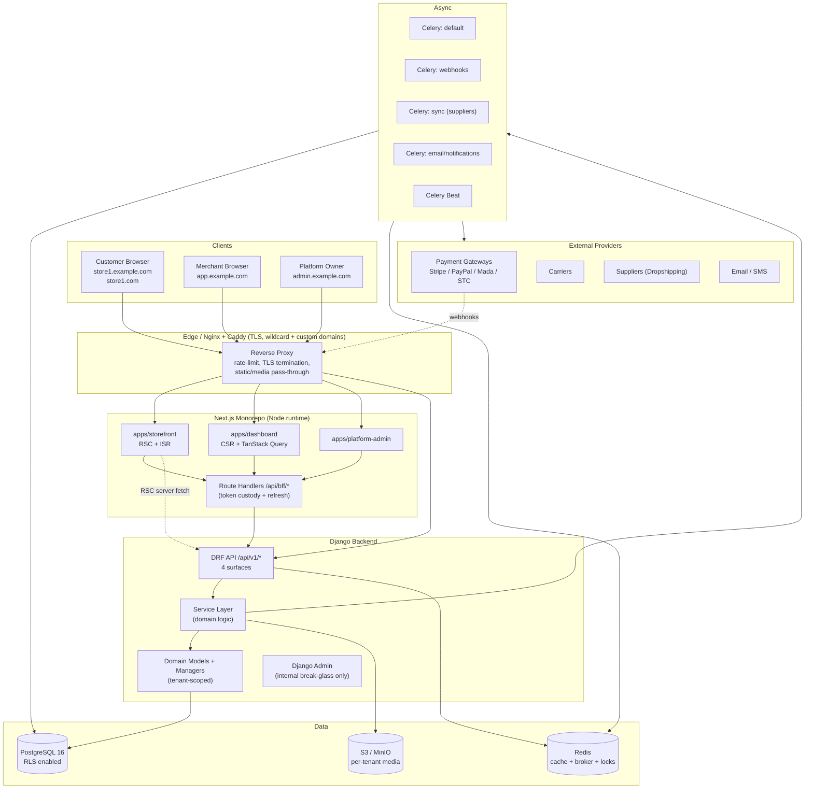
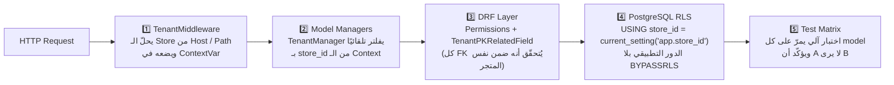
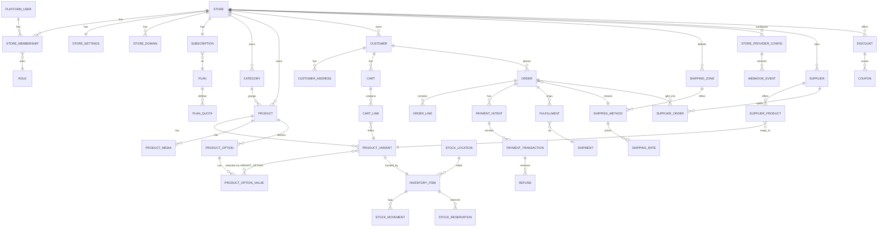
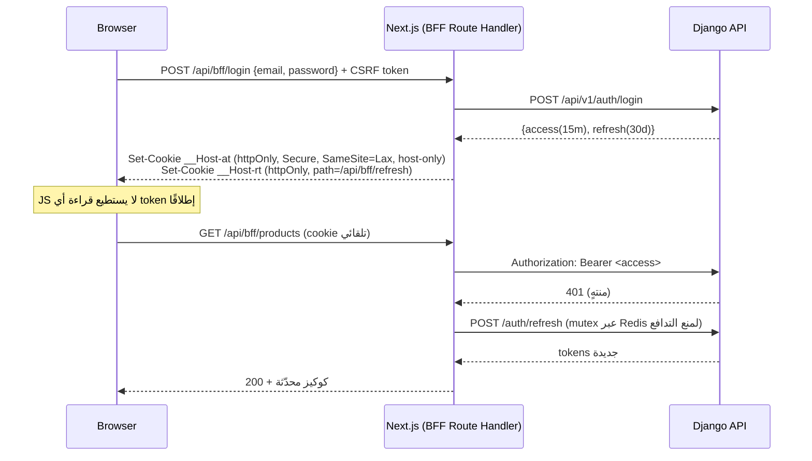
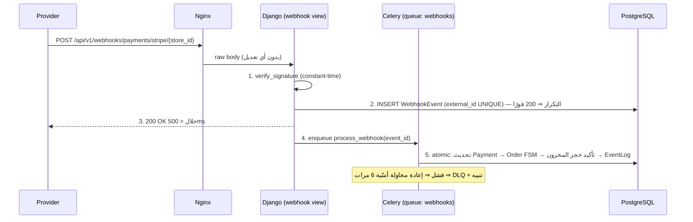
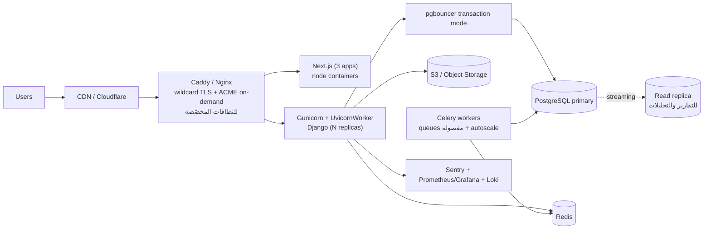

# Multi-Tenant SaaS E-Commerce — Architecture Design

> **الحالة:** ✅ معتمدة — Phase 1 (Bootstrap + Core + Tenancy) مُنفَّذة ومُختبَرة فعليًا. راجع [PHASE_1_REPORT.md](PHASE_1_REPORT.md) لما بُني بالضبط وكيف تحقّقتُ منه، و[DECISIONS.md](DECISIONS.md) للقرارات المعتمدة (D1–D8 + Q1–Q5 + 20 ضابطًا إضافيًا).
> **آخر تحديث:** 2026-08-20
> **بيئة التشغيل الفعلية المثبَّتة (مُتحقَّق منها، لا افتراضًا):** Python 3.12.10 · Django 5.2.17 LTS · PostgreSQL 18.6 · Redis 7. UUIDv7 يُولَّد بكود Python خاص بنا (`backend/apps/core/uuid7.py`) لا عبر stdlib 3.14 ولا `uuidv7()` الأصلية في Postgres — راجع PHASE_1_REPORT.md §1.1 للتبرير الكامل.

---

## 0. ملخّص تنفيذي (TL;DR)

| البُعد | القرار |
|---|---|
| Backend | Python 3.12 + Django 5.x + DRF |
| Frontend | Next.js 15 (App Router) + React 19 + TypeScript — 3 تطبيقات في Monorepo |
| Database | PostgreSQL 16 |
| Multi-Tenancy | **Shared Database + Shared Schema + `store_id`** مع **PostgreSQL Row-Level Security** كطبقة دفاع ثانية |
| Cache / Broker | Redis 7 |
| Background | Celery + Celery Beat (queues مفصولة) |
| Auth | JWT بعالَمين منفصلين (`platform` / `customer`) + BFF cookies في Next.js |
| API | REST مُوَثّق بـ OpenAPI 3.1 (drf-spectacular)، 4 أسطح: `auth` / `platform` / `dashboard` / `storefront` |
| Media | S3-compatible (MinIO محليًا) + signed URLs |
| Infra | Docker Compose للتطوير، Nginx/Caddy + Gunicorn(UvicornWorker) للإنتاج |
| مبدأ حاكم | **Django هو المصدر الوحيد للحقيقة** في البيانات والصلاحيات والأسعار والمخزون. Next.js واجهة فقط. |

---

## 1. System Architecture

### 1.1 المخطط العام



### 1.2 الطبقات داخل Django

```
HTTP  →  Middleware (security → tenant resolution → auth → quota)
      →  DRF View / ViewSet          # لا business logic — تحقّق + تفويض + تسلسل فقط
      →  Serializer                  # validation + shaping (tenant-aware FK fields)
      →  Service                     # الـ use case، يملك الـ transaction boundary
      →  Selector / QuerySet         # قراءات معقّدة (read models)
      →  Model + Manager             # القواعد الثابتة (invariants) + auto-scoping
      →  PostgreSQL (+ RLS policies)
```

**قواعد صارمة:**
- الـ View لا يحتوي أكثر من ~15 سطرًا ولا يستدعي `Model.objects` مباشرة لعمليات الكتابة.
- الـ Service يملك `transaction.atomic()` — لا nested atomic غير مقصود.
- الـ Signals **ممنوعة** في المسارات الحرجة (طلب، دفع، مخزون). تُستخدم فقط للأمور الجانبية (audit, cache invalidation).
- كل عملية كتابة تُصدر **Domain Event** يُسجَّل في `core.EventLog` ويُرسل للـ Celery عند الحاجة.

---

## 2. Multi-Tenant Strategy ⭐ (أهم قرار في المشروع)

### 2.1 مقارنة الخيارات

| المعيار | A) Shared Schema + `store_id` | B) Schema per Tenant (`django-tenants`) | C) Database per Tenant |
|---|---|---|---|
| **Security / Isolation** | متوسط بطبيعته — **يصبح قويًا جدًا مع RLS** | جيد | ممتاز |
| **Scalability (عدد المتاجر)** | آلاف → عشرات الآلاف بسهولة | ينهار عمليًا بعد ~1–2k schema | مئات فقط |
| **Migrations** | migration واحد لكل الجميع (ثوانٍ) | ‼️ يُعاد لكل schema — ساعات عند 5k متجر | ‼️ كارثي |
| **Performance** | ممتاز مع indexes مركّبة `(store_id, …)` | جيد، لكن `search_path` + connection churn | ممتاز لكل tenant منفردًا |
| **Cross-tenant analytics** | استعلام واحد | يتطلب `UNION ALL` عبر schemas | ETL منفصل إجباري |
| **Connection pooling** | ممتاز (pgbouncer transaction mode) | مشاكل مع pgbouncer بسبب `SET search_path` | يستهلك pools منفصلة |
| **Cost** | الأقل بفارق كبير | متوسط | الأعلى |
| **Backup / PITR** | على مستوى الـ cluster؛ استرجاع tenant واحد يحتاج أداة مخصّصة | استرجاع schema منفرد ممكن | الأسهل لكل tenant |
| **Per-tenant restore** | ⚠️ يحتاج logical export مخصّص | ✅ | ✅ |
| **Maintenance / Ops** | الأبسط | الأعقد | معقّد جدًا |

### 2.2 القرار الموصى به

> **Shared Database + Shared Schema + `store_id` + PostgreSQL Row-Level Security (RLS)**
> مع بقاء الباب مفتوحًا لـ **ترقية انتقائية**: أي متجر Enterprise ضخم يمكن نقله لاحقًا إلى قاعدة بيانات مخصّصة عبر Django database router دون تغيير أي كود domain.

**لماذا؟**
1. **طبيعة المنتج**: SaaS تجارة إلكترونية = آلاف التجّار الصغار. نموذج B ينهار عند الـ migrations؛ ونموذج C يقتل هامش الربح.
2. **العزل ليس خاصية قاعدة بيانات — بل خاصية معمارية**. RLS يعطينا ضمانًا على مستوى المحرّك نفسه: حتى لو نُسي فلتر في كود Python، **PostgreSQL نفسه يرفض إرجاع الصف**. هذا يجعل خطورة الخطأ البشري ≈ صفر.
3. Platform Admin Dashboard (المتطلب #18) يحتاج تجميعات عبر كل المتاجر — رخيصة جدًا هنا، ومؤلمة في B و C.
4. التكلفة والصيانة: قاعدة واحدة، نسخة احتياطية واحدة، monitoring واحد.

**العيب الوحيد المعترف به:** استرجاع بيانات متجر واحد فقط (per-tenant PITR). الحلّ: أمر إداري `dump_store <id>` يُصدّر كل بيانات المتجر منطقيًا (وهو مطلوب أصلًا لـ GDPR/data-export)، + نسخة نصف يومية لكل tenant للمتاجر المدفوعة.

### 2.3 نموذج الدفاع بخمس طبقات (Defense in Depth)



**التفاصيل:**

**الطبقة 1 — Context:** نستخدم `contextvars.ContextVar` وليس `threading.local` (ضروري للتوافق مع ASGI/async). يُصفَّر إجباريًا في `finally`.

**الطبقة 2 — Managers:**
```
TenantOwnedModel (abstract)
  ├─ store = FK(Store, on_delete=CASCADE, db_index=True)
  ├─ objects  = TenantManager()      # يفلتر تلقائيًا، ويرفع خطأ إذا لا يوجد context
  └─ unscoped = UnscopedManager()    # استخدام صريح فقط + مسجَّل في audit log
```
كل استعمال لـ `unscoped` يجب أن يكون في: platform admin، Celery tasks عابرة للمتاجر، أو migrations — ويُفحص في code review + بقاعدة `ruff` مخصّصة.

**الطبقة 3 — DRF:** `TenantPrimaryKeyRelatedField` يمنع هجوم "أرسل `category_id` تابع لمتجر آخر". كل استجابة 403 عبر الحدود التنانتية تتحوّل إلى **404** (منع تسريب معلومات الوجود).

**الطبقة 4 — RLS:** الاتصال يتم بدور `app_user` (بدون `BYPASSRLS`، ليس superuser). في بداية كل transaction:
```sql
SET LOCAL app.store_id = '<uuid>';
SET LOCAL app.bypass_tenant = 'off';
```
`SET LOCAL` (لا `SET` العادي) ← متوافق مع pgbouncer في وضع transaction pooling. الـ migrations تُشغَّل بدور منفصل `app_migrator` يملك الصلاحية.

**الطبقة 5 — Tests:** اختبار بارامتري يكتشف تلقائيًا كل subclass من `TenantOwnedModel` وينشئ صفًا لكل من المتجرين ثم يؤكد العزل — أي model جديد يُضاف يدخل الاختبار تلقائيًا دون كتابة اختبار يدوي. بالإضافة إلى اختبار على مستوى HTTP لكل endpoint.

### 2.4 المعرّفات (IDs)
- كل نموذج تنانتي يستخدم **UUIDv7** كمفتاح أساسي (مرتّب زمنيًا ← لا تشظّي في الـ B-tree، وأداء قريب من BIGINT).
- لا مفاتيح تسلسلية مكشوفة في أي URL أو API — يمنع IDOR والتعداد وتسريب حجم الأعمال (كم طلبًا لديك؟).
- استثناء: `Order.number` مقروء بشريًا وفريد **داخل المتجر** فقط (`#1001`) — مع unique constraint مركّب `(store, number)`.

---

## 3. Backend Architecture — Django Project Structure

```
backend/
├── config/
│   ├── settings/
│   │   ├── base.py          # مشترك
│   │   ├── local.py         # تطوير
│   │   ├── test.py          # اختبارات
│   │   └── production.py    # إنتاج (يفشل إذا نقص أي متغيّر إلزامي)
│   ├── urls.py              # يوجّه للأسطح الأربعة
│   ├── celery.py
│   ├── asgi.py / wsgi.py
├── apps/
│   ├── core/            # BaseModel, TimeStamped, SoftDelete, Money, EventLog,
│   │                    # AuditLog, exceptions, pagination, throttling, openapi hooks
│   ├── tenancy/         # ContextVar, TenantManager, RLS migration helpers,
│   │                    # TenantTask/PlatformTask -- domain-agnostic only.
│   │                    # (Correction from Phase 1: TenantMiddleware itself
│   │                    # lives in apps/stores, not here -- resolving "which
│   │                    # store" inherently needs Store/StoreDomain, and
│   │                    # tenancy must never import a domain app. Enforced
│   │                    # by the import-linter contract in pyproject.toml,
│   │                    # not just a comment. See PHASE_1_REPORT.md.)
│   ├── accounts/        # PlatformUser (AbstractBaseUser), StoreMembership, Role,
│   │                    # Permission catalog, JWT, email verification, password reset
│   ├── stores/          # Store, StoreDomain, StoreSettings, Branding, StaffInvite
│   ├── catalog/         # Category, Collection, Product, ProductVariant,
│   │                    # ProductOption/Value, ProductMedia, Tag, SEO
│   ├── inventory/       # StockLocation, InventoryItem, StockReservation,
│   │                    # StockMovement, Adjustment, LowStockAlert
│   ├── customers/       # Customer (per-store), CustomerAddress, CustomerAuth
│   ├── carts/           # Cart, CartLine, cart token, merge/abandon logic
│   ├── pricing/         # Discount, Coupon, TaxRate/TaxZone, PriceCalculator (نقية)
│   ├── orders/          # Order, OrderLine, OrderStatus FSM, Fulfillment, Return, Refund
│   ├── payments/        # PaymentProvider ABC, StoreProviderConfig (مشفّرة),
│   │                    # PaymentIntent, Transaction, WebhookEvent, providers/*
│   ├── shipping/        # ShippingZone, ShippingMethod, ShippingRate,
│   │                    # CarrierProvider ABC, Shipment, providers/*
│   ├── suppliers/       # SupplierProvider ABC, Supplier, SupplierProduct,
│   │                    # SupplierOrder, sync tasks (بنية فقط في v1)
│   ├── subscriptions/   # Plan, PlanFeature, PlanQuota, Subscription,
│   │                    # UsageRecord, Entitlements service, Invoice
│   ├── notifications/   # NotificationTemplate, Channel ABC, dispatch, preferences
│   ├── analytics/       # read models + daily rollups (Celery Beat)
│   └── platform_admin/  # API سطح المنصة (لا models خاصة به تقريبًا)
├── tests/
│   ├── factories/
│   ├── isolation/       # اختبارات العزل التنانتي
│   ├── integration/
│   └── e2e_api/
├── manage.py, pyproject.toml, Dockerfile
```

**قاعدة الاعتماديات (Dependency Rule):** الأسهم تتّجه للداخل فقط.
```
platform_admin ─┐
notifications ──┤
analytics ──────┤
suppliers ──────┼──▶ orders ──▶ payments/shipping/pricing ──▶ inventory ──▶ catalog ──▶ stores ──▶ accounts ──▶ tenancy ──▶ core
subscriptions ──┘
```
`catalog` **لا يستورد** من `orders` أبدًا. الاتصال العكسي يتم عبر Domain Events فقط. تُفرض هذه القاعدة آليًا بـ `import-linter` في الـ CI.

---

## 4. Database Architecture

### 4.1 مخطط العلاقات (مبسّط)



### 4.2 النماذج الأساسية (Main Models)

**tenancy / stores**
| Model | حقول رئيسية | ملاحظات |
|---|---|---|
| `Store` | `id(uuid7)`, `name`, `slug`, `status(active/suspended/pending/closed)`, `country`, `currency`, `default_language`, `timezone`, `owner_id`, `created_at` | جذر الـ tenant. `slug` فريد عالميًا. |
| `StoreDomain` | `store`, `hostname(unique)`, `kind(subdomain/custom)`, `is_primary`, `verified_at`, `ssl_status` | مفهرس + مُخزَّن في Redis. |
| `StoreSettings` | tax settings, order number prefix, checkout options, branding, contact, policies | 1:1 مع Store |

**accounts**
| Model | حقول رئيسية |
|---|---|
| `PlatformUser` | `email(unique)`, `password`, `full_name`, `is_platform_staff`, `email_verified_at`, `mfa_*` |
| `StoreMembership` | `user`, `store`, `role`, `status`, `invited_by`, `permissions_override(JSONB)` — unique `(user, store)` |
| `Role` | `store(nullable=system role)`, `name`, `permissions(ARRAY)` |

**catalog**
| Model | حقول رئيسية |
|---|---|
| `Product` | `store`, `title`, `slug`, `description`, `status(draft/active/archived)`, `product_type`, `tags`, `seo_title`, `seo_description`, `has_variants` — unique `(store, slug)` |
| `ProductVariant` | `product`, `sku`, `barcode`, `price_amount(BIGINT minor units)`, `compare_at_amount`, `cost_amount`, `weight_grams`, `dims`, `position`, `image` — unique `(store, sku)` |
| `ProductOption` / `ProductOptionValue` / `VariantOptionValue` | نموذج EAV مضبوط للمتغيّرات (Size/Color) |

**inventory** (نظام مستقل — ليس عمود `stock` داخل المنتج)
| Model | حقول رئيسية |
|---|---|
| `StockLocation` | `store`, `name`, `is_default`, `address` |
| `InventoryItem` | `store`, `variant`, `location`, `on_hand`, `reserved`, `low_stock_threshold`, `track_inventory`, `allow_backorder` — `available = on_hand - reserved` (GENERATED column) |
| `StockReservation` | `inventory_item`, `cart/order`, `quantity`, `expires_at`, `state` |
| `StockMovement` | `inventory_item`, `delta`, `reason(sale/return/adjustment/sync/…)`, `reference`, `actor`, `created_at` — **append-only، مصدر الحقيقة التاريخي** |

قيود قاعدة بيانات إلزامية:
```
CHECK (on_hand >= 0)
CHECK (reserved >= 0)
CHECK (reserved <= on_hand)   -- ما لم يُسمح بالـ backorder
```

**orders**
| Model | حقول رئيسية |
|---|---|
| `Order` | `store`, `number`, `customer`, `email`, `status`, `payment_status`, `fulfillment_status`, `currency`, `subtotal/discount/tax/shipping/total` (كلها BIGINT minor units)، `billing_address(JSONB snapshot)`, `shipping_address(JSONB snapshot)`, `placed_at` |
| `OrderLine` | `order`, `variant(SET_NULL)`, **`title/sku/options` منسوخة كـ snapshot**, `unit_price`, `quantity`, `discount`, `tax`, `total` |

> **مبدأ Snapshot:** الطلب لا يعتمد على المنتج بعد إنشائه. حذف/تعديل المنتج لا يغيّر أي فاتورة قديمة.

### 4.3 استراتيجية الفهرسة
- كل فهرس على جدول تنانتي يبدأ بـ `store_id`: `(store_id, status, created_at DESC)` للطلبات، `(store_id, slug)` للمنتجات.
- فهارس جزئية: `WHERE status='active'` للمنتجات المعروضة.
- بحث: `pg_trgm` GIN على `title` + `tsvector` مولّد للبحث النصي (v1). Meilisearch/Elastic لاحقًا خلف واجهة `SearchBackend`.
- `JSONB` مع فهارس GIN فقط عند الحاجة الفعلية (metadata, addresses).

### 4.4 النقود
- التخزين: `BIGINT` بوحدات المال الصغرى (هللة/سنت) + `currency CHAR(3)` — **لا `FloatField` مطلقًا**.
- الحساب: `Decimal` في Python داخل `PriceCalculator`، والتقريب مرة واحدة في نهاية السلسلة (half-up).
- عملة واحدة لكل متجر في v1 (راجع القرار D5).

---

## 5. API Architecture

### 5.1 الأسطح الأربعة

| السطح | المسار | المستهلك | كيف يُحدَّد الـ Tenant | المصادقة |
|---|---|---|---|---|
| Auth | `/api/v1/auth/…` | الجميع | لا ينطبق / من الـ Host | عام |
| Platform | `/api/v1/platform/…` | Platform Admin | لا يوجد — عابر للمتاجر | JWT `platform` + `is_platform_staff` |
| Dashboard | `/api/v1/dashboard/stores/{store_id}/…` | Store Owner/Staff | **من المسار** (يُتحقّق من الـ Membership) | JWT `platform` |
| Storefront | `/api/v1/storefront/…` | العملاء + Next.js RSC | **من الـ Host header** | عام أو JWT `customer` |

> اختيار المسار للـ Dashboard (بدلاً من header) مقصود: صريح، قابل للتسجيل والتدقيق، ويمنع أخطاء "المتجر الخاطئ" الصامتة.

### 5.2 المعايير المشتركة
- **Versioning:** `URLPathVersioning` — `/api/v1/`. سياسة إهلاك مُعلنة (نسختان متزامنتان كحد أقصى).
- **Docs:** `drf-spectacular` → OpenAPI 3.1 على `/api/schema/`، Swagger UI + Redoc. الـ schema **مثبّت في Git** ويُفحص في CI (أي تغيير غير مقصود = فشل build).
- **Pagination:** `PageNumberPagination` للوحات التحكم (تحتاج أرقام صفحات)، `CursorPagination` للقوائم الطويلة في الـ storefront.
- **Filtering/Search/Sort:** `django-filter` + `SearchFilter` + `OrderingFilter` مع allowlist صريح للحقول.
- **Errors:** استجابة موحّدة على نمط RFC 9457:
  ```json
  { "type": "validation_error", "title": "...", "status": 400,
    "detail": "...", "errors": [{"field": "price", "code": "min_value", "message": "..."}],
    "request_id": "01J..." }
  ```
- **Idempotency:** header `Idempotency-Key` إلزامي على `POST /checkout/complete` و`POST /payments/*` — مخزّن في Redis + جدول احتياطي 24 ساعة.
- **Rate limiting:** طبقتان — Nginx (IP) و DRF Throttle (per-user, per-store, per-endpoint-class) بمخزن Redis. الحدود تتغيّر حسب خطة الاشتراك.
- **Request ID:** يُولَّد على الحافة ويمرّ في كل log وكل استجابة.
- **Response caching:** `Cache-Control` + ETag لنقاط الـ storefront العامة، مع إبطال موجّه بالوسوم عند تغيّر المنتج.

### 5.3 عيّنة من نقاط النهاية

```
POST   /api/v1/auth/register                    # merchant
POST   /api/v1/auth/login                       # → access + refresh
POST   /api/v1/auth/refresh                     # rotation + reuse detection
POST   /api/v1/auth/logout
POST   /api/v1/auth/password/reset
POST   /api/v1/auth/email/verify
GET    /api/v1/auth/me                          # user + memberships + permissions

POST   /api/v1/dashboard/stores                 # إنشاء متجر (provisioning)
GET    /api/v1/dashboard/stores/{sid}/overview
CRUD   /api/v1/dashboard/stores/{sid}/products[/{id}][/variants]
POST   /api/v1/dashboard/stores/{sid}/inventory/adjust
GET    /api/v1/dashboard/stores/{sid}/orders?status=&q=&created_after=
POST   /api/v1/dashboard/stores/{sid}/orders/{id}/fulfill|cancel|refund
CRUD   /api/v1/dashboard/stores/{sid}/shipping/zones|methods|rates
CRUD   /api/v1/dashboard/stores/{sid}/payments/providers    # write-only secrets
CRUD   /api/v1/dashboard/stores/{sid}/staff|roles|discounts|settings

GET    /api/v1/storefront/context                # theme, currency, locale, nav
GET    /api/v1/storefront/products?category=&q=&sort=
GET    /api/v1/storefront/products/{slug}
POST   /api/v1/storefront/cart/lines             # cart token cookie
POST   /api/v1/storefront/checkout/start|address|shipping|payment|complete
POST   /api/v1/storefront/customer/register|login|orders

GET    /api/v1/platform/stores?status=&plan=
POST   /api/v1/platform/stores/{id}/suspend|activate
CRUD   /api/v1/platform/plans|subscriptions|users
GET    /api/v1/platform/analytics/overview
GET    /api/v1/platform/audit-logs

POST   /api/v1/webhooks/payments/{provider}/{store_id}     # موقّع، idempotent
```

---

## 6. Authentication Architecture

### 6.1 عالَما الهوية (Identity Realms) — قرار جوهري

| | `PlatformUser` | `Customer` |
|---|---|---|
| من؟ | مالك المنصة، أصحاب المتاجر، الموظفون | مشتري في متجر محدّد |
| تفرّد البريد | عالمي | **داخل المتجر فقط** (`unique(store, email)`) |
| الجدول | `accounts_platformuser` (`AUTH_USER_MODEL`) | `customers_customer` (مصادقة مستقلة) |
| الـ JWT | `aud: "platform"` | `aud: "storefront"` + `store_id` مقيّد |

**لماذا الفصل؟** نفس الشخص قد يشتري من متجر A ومتجر B — يجب ألا يشترك في حساب واحد بينهما (تسرّب خصوصية بين تجّار متنافسين). كما أن دمجهما يجعل كل عميل تجزئة مستخدمًا في `AUTH_USER_MODEL` — كارثة أداء وأمان. (راجع القرار D2.)

### 6.2 استراتيجية الـ JWT

```
Access Token   : 15 دقيقة  | مطالبات: sub, aud, realm, jti, iat, exp  (بدون صلاحيات!)
Refresh Token  : 30 يومًا  | rotating, family-tracked, reuse ⇒ إبطال العائلة كاملة
```

**لماذا لا نضع الصلاحيات داخل الـ token؟** لأن سحب صلاحية موظف يجب أن يسري **فورًا**، لا بعد 15 دقيقة. الصلاحيات تُحلّ لكل طلب من DB مع cache في Redis (TTL 60ث، يُبطَل عند تعديل العضوية).

**التخزين — نمط BFF:**


**قواعد الكوكيز الحرجة:**
- 🚫 **ممنوع منعًا باتًا** استخدام `Domain=.example.com` لكوكيز العملاء — سيجعل جلسة عميل متجر A تُرسل تلقائيًا إلى `store-b.example.com`. **كل كوكي host-only.**
- استخدام بادئة `__Host-` (تفرض Secure + Path=/ + بدون Domain).
- CSRF: double-submit token لكل طلب mutating عبر الـ BFF + `SameSite=Lax`.
- النطاقات المخصّصة: كل نطاق يحمل كوكيزه الخاصة بطبيعته → عزل مجّاني.

### 6.3 التدفّقات
- **Registration:** إنشاء `PlatformUser` غير مُفعّل → بريد تحقق (توقيع `TimestampSigner`, صلاحية 24 ساعة) → تفعيل.
- **Password reset:** رمز مرّة واحدة، hashed في DB، صلاحية 30 دقيقة، يُبطل كل الجلسات.
- **Brute force:** `django-axes` — قفل تصاعدي على (IP + email)، captcha بعد 5 محاولات، تنبيه أمني.
- **MFA (TOTP):** إلزامي على حسابات Platform Owner، اختياري لأصحاب المتاجر (Phase 17).
- **RBAC:** كتالوج صلاحيات ثابت (`catalog.product.write`, `orders.refund`, …) → `Role` → `StoreMembership`. الأدوار الجاهزة: `owner`, `admin`, `manager`, `staff`, `viewer` + أدوار مخصّصة لكل متجر.

---

## 7. Frontend Architecture (Next.js)

### 7.1 بنية الـ Monorepo

```
frontend/                      # pnpm workspaces + Turborepo
├── apps/
│   ├── storefront/            # واجهة العميل — متعدّدة المستأجرين على مستوى الـ host
│   ├── dashboard/             # app.example.com
│   └── platform-admin/        # admin.example.com
├── packages/
│   ├── api-client/            # ⚙️ مولَّد من OpenAPI — لا يُكتب يدويًا
│   ├── ui/                    # مكوّنات مشتركة (shadcn/ui + Tailwind)
│   ├── auth/                  # منطق BFF/cookies/refresh مشترك
│   ├── i18n/                  # ar/en + RTL
│   └── config/                # eslint, tsconfig, tailwind presets
```

**تطبيقات منفصلة وليست واحدًا:** يمنع تسرّب كود لوحة المنصة إلى حزمة الـ storefront العامة، ويسمح بنشر ونطاقات ومستويات أمان مختلفة.

### 7.2 Storefront Architecture

```
app/
├── middleware.ts              # يقرأ Host → يستدعي /storefront/context (مُخزَّن) → rewrite
├── [locale]/
│   ├── page.tsx               # الرئيسية (RSC + ISR)
│   ├── products/[slug]/       # صفحة المنتج — generateMetadata لـ SEO/OG
│   ├── categories/[slug]/
│   ├── search/
│   ├── cart/                  # client component
│   ├── checkout/              # server actions ← BFF ← Django
│   └── account/(orders|profile|addresses)
├── api/bff/*                  # حارس التوكن
├── sitemap.ts, robots.ts, opengraph-image.tsx   # لكل مستأجر
```

- **العرض:** RSC + ISR مع `revalidateTag("store:{id}:product:{id}")`. Django يستدعي webhook إبطال عند أي تعديل ← صفحات ثابتة السرعة مع بيانات طازجة.
- **الثيم:** يُجلب من `/storefront/context` ويُحقن كـ CSS variables — لا build منفصل لكل متجر.
- **السلة:** مصدر الحقيقة في الـ backend. المتصفح يحمل `cart_token` فقط في httpOnly cookie.
- **RTL/i18n:** دعم عربي/إنجليزي كامل من اليوم الأول (`dir` من إعدادات المتجر).
- **الأداء:** الأهداف — LCP < 2.5s، CLS < 0.1، `next/image` مع AVIF/WebP، حزمة JS للصفحة الرئيسية < 120KB gzip.

### 7.3 Store Dashboard Architecture
- App Router، غالبًا client-side مع **TanStack Query** (cache/optimistic/invalidation).
- **العميل مولَّد بالكامل من OpenAPI** (`openapi-typescript` + `openapi-fetch`) → أي تغيير في الـ backend يكسر الـ TypeScript build في CI قبل الإنتاج.
- النماذج: `react-hook-form` + `zod` (المخططات مولّدة من الـ schema حيثما أمكن).
- محدّد المتجر (store switcher) في الـ layout → كل مسار تحت `/stores/[storeId]/…` يعكس مسار الـ API 1:1.
- الـ UI يخفي ما لا يملك المستخدم صلاحيته — **لكن هذا تجميل فقط؛ الفرض الحقيقي في Django دائمًا.**
- حالات فارغة، skeletons، جداول افتراضية (virtualized) للقوائم الكبيرة، رفع صور مباشر إلى S3 عبر presigned URLs.

### 7.4 Platform Admin Architecture
- تطبيق منفصل على `admin.example.com`، خلف MFA إلزامي + allowlist IP اختياري.
- عرض شامل: المتاجر، المستخدمون، الاشتراكات، الخطط، الإيرادات، سجلات التدقيق، صحة النظام.
- **"Impersonation" (الدخول كتاجر للدعم):** ميزة عالية الخطورة — تُبنى بجلسة مؤقتة موقّتة، بانر ظاهر دائمًا، وتسجيل كامل في `AuditLog`، وبدون صلاحية الوصول لأسرار الدفع.

### 7.5 API Contract (العقد بين Next.js و Django)
1. Django هو **المصدر الوحيد** للعقد: `drf-spectacular` يولّد `openapi.json`.
2. الملف مثبّت في Git تحت `backend/schema/openapi.json`.
3. CI: `make schema-check` — إن اختلف المولَّد عن المثبّت ⇒ فشل.
4. `pnpm generate:api` ينتج أنواع TypeScript في `packages/api-client`.
5. CI للواجهة يعيد التوليد ويتأكد من عدم وجود فروق → **استحالة انحراف العقد بصمت**.
6. تغيير كاسر ⇒ نسخة API جديدة، لا تعديل صامت.

---

## 8. Payment Architecture

### 8.1 التجريد
```python
class PaymentProvider(ABC):            # واجهة موحّدة، بلا أي منطق خاص بمزوّد
    def create_payment(ctx: PaymentContext) -> PaymentInitResult   # redirect أو client_secret
    def capture(txn) -> TransactionResult
    def refund(txn, amount) -> TransactionResult
    def verify_webhook(raw_body, headers, secret) -> WebhookEvent
    def map_event(event) -> DomainPaymentEvent      # ← تطبيع لكل المزوّدين
    @property capabilities -> {auth_capture, partial_refund, hosted_page, 3ds, ...}
```
`providers/stripe.py`, `providers/paypal.py`, `providers/mada.py`, `providers/stcpay.py`, `providers/manual_cod.py` (الدفع عند الاستلام — أساسي للسوق الخليجي)، `providers/mock.py` (للاختبارات).

**التسجيل عبر Registry** — إضافة مزوّد جديد = ملف واحد + إدخال في السجل. صفر تعديل في `orders`.

### 8.2 نموذج البيانات
```
StoreProviderConfig(store, provider_key, mode(test/live), is_enabled,
                    credentials_encrypted, public_metadata, webhook_secret_encrypted)
PaymentIntent(store, order, provider_config, amount, currency, state, provider_ref, idempotency_key)
PaymentTransaction(intent, kind(authorize/capture/refund/void), amount, state, provider_ref, raw_response_redacted)
WebhookEvent(store, provider, external_id UNIQUE, signature_valid, payload_redacted, processed_at, attempts)
```

### 8.3 الأسرار
- تشفير مغلّف: `credentials_encrypted` بـ **AES-GCM** بمفتاح بيانات، والمفتاح مغلّف بمفتاح رئيسي من env/KMS. تدوير المفاتيح مدعوم (`key_version`).
- **write-only في الـ API**: لا endpoint يعيد السر إطلاقًا — فقط `last4` أو `••••live_9f2`.
- منقّي logs مركزي (`SecretRedactionFilter`) يحذف الأنماط الحساسة قبل أي كتابة.
- 🚫 لا تُخزَّن أرقام بطاقات أو CVV إطلاقًا — **Hosted Checkout / Tokenization فقط** ⇒ نبقى ضمن نطاق PCI-DSS SAQ-A.

### 8.4 الـ Webhooks

**الضمانات:** التوقيع أولًا، `external_id` فريد للـ idempotency، الاستجابة سريعة والمعالجة غير متزامنة، وآلة الحالة ترفض التراجع للخلف (حدث قديم وصل متأخرًا لا يُلغي حالة أحدث).

### 8.5 فوترة الـ SaaS نفسها
منفصلة تمامًا عن دفعات المتاجر: تستخدم حساب **المنصة** لدى المزوّد. عزل الشيفرة يمنع الخلط بين "أموال التاجر" و"أموال المنصة".

---

## 9. Shipping Architecture

```
ShippingZone(store, name, countries[], regions[], postal_patterns[])
ShippingMethod(zone, name, kind: flat|free|weight_based|price_based|carrier_calculated, is_active)
ShippingRate(method, min_value, max_value, price_amount)   # value = وزن أو سعر حسب الـ kind
Shipment(order, fulfillment, carrier, tracking_number, status, label_url, events[])
```
- محرّك التسعير نقي (pure function): `(cart, address, store_config) → [RateOption]` — قابل للاختبار بالكامل بلا DB.
- `CarrierProvider` ABC (`get_rates`, `create_shipment`, `track`, `cancel`) → SMSA/Aramex/DHL لاحقًا. في v1: المزوّدون اليدويون فقط + `MockCarrier`.
- الأسعار المحسوبة من شركة الشحن تُخزَّن مؤقتًا في Redis (TTL قصير) وتُعاد كـ quote مربوط بالسلة.

---

## 10. Supplier / Dropshipping Architecture (بنية فقط في v1)

```python
class SupplierProvider(ABC):
    def fetch_catalog(cursor) -> Iterator[SupplierProductDTO]
    def fetch_inventory(skus) -> dict[str, int]
    def fetch_prices(skus) -> dict[str, Money]
    def place_order(supplier_order) -> SupplierOrderResult
    def track_order(ref) -> TrackingInfo
```
```
Supplier(store, provider_key, credentials_encrypted, is_active, sync_settings)
SupplierProduct(supplier, external_id, raw_payload, cost, stock, mapped_variant→nullable)
PriceRule(store, supplier, strategy: margin%|markup|fixed, rounding, min_profit)
SupplierOrder(store, order, supplier, external_ref, status, items, cost_total)
```
- الاستيراد على مرحلتين: **staging** (`SupplierProduct`) ثم **ترقية صريحة** إلى `Product` بموافقة التاجر — لا يُلوَّث الكتالوج تلقائيًا.
- المزامنة عبر Celery Beat في queue `sync` (معزول حتى لا يخنق الطلبات)، بجدولة متدرّجة لكل مورّد.
- الطلب الواحد قد يُقسَّم إلى عدّة `SupplierOrder` (منتجات من موردين مختلفين).
- **v1: الواجهات + النماذج + `MockSupplier` فقط.** لا تكامل حقيقي قبل استقرار النواة.

---

## 11. SaaS Subscription Architecture

```
Plan(code, name, price_monthly, price_yearly, currency, is_public, trial_days)
PlanFeature(plan, feature_key, enabled)             # custom_domain, api_access, staff_roles…
PlanQuota(plan, quota_key, limit, overage_policy)   # products, orders/month, staff, storage_mb
Subscription(store, plan, status, current_period_start/end, cancel_at, trial_ends_at, provider_ref)
UsageRecord(store, quota_key, period, used)         # عدّاد Redis + تثبيت دوري في PG
Invoice(subscription, amount, status, issued_at, paid_at, provider_ref)
```

**خدمة الاستحقاقات (Entitlements) — نقطة تحقّق واحدة:**
```
entitlements.require_feature(store, "custom_domain")     → 402 Payment Required
entitlements.check_quota(store, "products", delta=1)     → 402 + رسالة ترقية
```
تُستدعى في الـ Services (لا الـ Views) ← تُطبَّق تلقائيًا على API والـ admin واستيراد الدفعات معًا.

**عند تجاوز الحد / انتهاء الاشتراك:** المتجر لا يُحذف — بل يدخل `read_only` ثم `suspended`. المتجر يظل يقبل التصفّح ويوقف الشراء (قابل للضبط)، والبيانات محفوظة 90 يومًا.

**تغيير الخطة لاحقًا:** الخطط بيانات وليست كودًا — لا حاجة لأي deploy لإضافة خطة أو تعديل حدّ.

---

## 12. Security Architecture

| المحور | التطبيق |
|---|---|
| Tenant Isolation | الطبقات الخمس (§2.3) + اختبارات إلزامية |
| Transport | HTTPS إجباري، HSTS + preload، TLS 1.2+ |
| Headers | CSP صارم (بـ nonce)، `X-Content-Type-Options`, `Referrer-Policy`, `Permissions-Policy`, `X-Frame-Options: DENY` |
| Cookies | `Secure`, `HttpOnly`, `SameSite`, بادئة `__Host-`, **host-only دائمًا** |
| CSRF | Django CSRF على الجلسات + double-submit token في الـ BFF |
| CORS | allowlist ديناميكي من `StoreDomain` — لا `*` أبدًا |
| Passwords | Argon2id (`PASSWORD_HASHERS`) + قواعد قوة + كشف كلمات مسرّبة |
| AuthZ | تحقّق على مستوى الكائن دائمًا، والرفض التنانتي يُعاد كـ **404** |
| Rate limiting | Nginx + DRF throttles + قفل brute-force تصاعدي |
| Input | Serializers صارمة (`unknown fields = error`)، حدود حجم، تحقّق نوع MIME للرفع، فحص فيروسات اختياري |
| SQL Injection | ORM فقط؛ أي `raw()` يمرّ بمراجعة إلزامية وبارامترات مربوطة |
| XSS | React يهرّب افتراضيًا؛ وصف المنتج (HTML) يُنقّى بـ `nh3/bleach` على الـ **backend** allowlist |
| SSRF | جلب أي URL خارجي (استيراد صور/موردين) يمرّ عبر عميل يمنع الشبكات الداخلية وredirects |
| File upload | presigned URLs، أنواع محصورة، حجم محدود، عرض من نطاق منفصل، مسارات per-tenant |
| Secrets | env vars فقط، `.env` في `.gitignore`، gitleaks في CI، تشفير مغلّف في DB |
| Audit | `AuditLog` غير قابل للتعديل: من، ماذا، أي متجر، IP، قبل/بعد |
| Logs | JSON منظّم + منقّي أسرار مركزي — لا كلمات مرور/بطاقات/tokens أبدًا |
| Dependencies | `pip-audit` + `pnpm audit` + Dependabot + Trivy على الصور |
| Backups | PITR يومي + اختبار استرجاع شهري موثّق |

**نموذج التهديد (أهم 5 سيناريوهات نختبرها صراحةً):**
1. تاجر يستبدل `store_id` في المسار → 404 (Membership + RLS).
2. تاجر يرسل `variant_id` تابعًا لمتجر آخر داخل payload → خطأ تحقّق (`TenantPKRelatedField`).
3. عميل من متجر A يحمل كوكيزه إلى متجر B → التوكن مقيّد بـ `store_id` + الكوكي host-only.
4. مهاجم يعيد بثّ webhook قديم → التوقيع + `external_id` فريد + FSM لا يتراجع.
5. موظف مسحوبة صلاحياته يستخدم access token قديم → الصلاحيات تُحلّ لكل طلب، لا من الـ token.

---

## 13. Docker & Deployment Architecture

### 13.1 التطوير المحلي (`docker compose up`)
| الخدمة | الوصف |
|---|---|
| `postgres` | PostgreSQL 16 + `pg_trgm` + دوران أدوار RLS |
| `redis` | cache + broker + locks |
| `backend` | Django (runserver/uvicorn --reload) |
| `celery-worker` | queues: `default,webhooks,email` |
| `celery-sync` | queue: `sync` (معزول) |
| `celery-beat` | جدولة |
| `storefront` / `dashboard` / `platform-admin` | Next.js dev servers |
| `nginx` | يوجّه `*.lvh.me` → storefront، `app.lvh.me` → dashboard، `/api` → backend |
| `mailhog` | التقاط البريد |
| `minio` | S3 محلي |

النطاقات المحلية: `lvh.me` (يشير إلى 127.0.0.1 مع كل الـ subdomains) ← اختبار حقيقي للـ multi-tenancy بلا تعديل `hosts`.
تشغيل بأمر واحد: `make up` ثم `make seed` (متجران تجريبيان ببيانات كاملة).

### 13.2 الإنتاج

- **صور Docker:** multi-stage، non-root user، بلا أدوات build في النهائية، health checks.
- **الترحيلات:** خطوة منفصلة قبل النشر، متوافقة رجعيًا (expand/contract)، `CREATE INDEX CONCURRENTLY`، بلا تعطيل.
- **CI/CD (GitHub Actions):**
  `lint (ruff+black+mypy) → import-linter → migrations --check → pytest+coverage → schema-check → frontend (tsc+eslint+vitest) → playwright e2e → docker build → trivy → gitleaks → deploy`
- **النطاقات المخصّصة:** تحقّق DNS (TXT) → CNAME → إصدار شهادة تلقائي عند الطلب (Caddy on-demand TLS مع endpoint تفويض يستعلم `StoreDomain`).
- **المراقبة:** Sentry للأخطاء، `/healthz` و`/readyz`، مقاييس per-tenant (طلبات، أخطاء، زمن استجابة)، تنبيهات على DLQ وطول طوابير Celery.

---

## 14. Testing Strategy

| النوع | الأداة | الهدف |
|---|---|---|
| Unit | pytest | محرّكات نقية: التسعير، الضرائب، الشحن، آلة حالة الطلب |
| Integration | pytest-django + factory-boy | خدمات مع DB حقيقية (بلا mocks لقاعدة البيانات) |
| API | DRF APIClient | كل endpoint: 200/400/401/403/404 + شكل الاستجابة |
| **Tenant Isolation** | بارامتري تلقائي | ⭐ يكتشف كل `TenantOwnedModel` ويثبت أن A لا يرى B |
| Permissions | مصفوفة | (دور × endpoint) لكل الأدوار |
| Concurrency | خيوط حقيقية | لا بيع زائد تحت 50 طلب شراء متزامن لآخر قطعة |
| Payments | mock provider + أحداث مسجّلة | idempotency، توقيع خاطئ، أحداث خارج الترتيب |
| Contract | schema snapshot | يمنع كسر عقد الـ API بصمت |
| Frontend | vitest + testing-library | مكوّنات ومنطق |
| E2E | Playwright | التسجيل → إنشاء متجر → منتج → شراء → دفع → تتبّع |
| Load | k6 (اختياري) | قياس أساس على الكتالوج والـ checkout |
| Security | bandit, pip-audit, gitleaks, ZAP baseline | في CI |

**بوّابات الجودة (Quality Gates):** تغطية ≥ 90% في `orders/payments/inventory/tenancy/accounts`، و≥ 80% إجمالًا. **أي اختبار فاشل = المرحلة غير مكتملة**، لا انتقال.

---

## 15. Development Roadmap

المراحل الـ 20 مع ما يُسلَّم فعليًا في كل مرحلة:

| # | المرحلة | التسليم | معيار الإنجاز (DoD) |
|---|---|---|---|
| 0 | Bootstrap | Monorepo، Docker، CI، pre-commit، إعدادات | `make up` يعمل، CI أخضر |
| 1 | Core + Tenancy | `core` + `tenancy` + RLS + Managers | اختبار العزل الأساسي يمر |
| 2 | Accounts & Auth | User، JWT، RBAC، التحقق، إعادة التعيين | مصفوفة صلاحيات كاملة تمر |
| 3 | Stores & Provisioning | إنشاء متجر + domains + settings | متجر جاهز في < 3 ثوانٍ |
| 4 | Catalog | منتجات، متغيّرات، فئات، وسائط، بحث | CRUD + عزل + بحث يمر |
| 5 | Inventory | المخزون والحجوزات والحركات | اختبار التزامن يمر — لا بيع زائد |
| 6 | Cart & Pricing | سلة، خصومات، ضرائب، محرّك تسعير | إعادة تسعير كاملة على الخادم |
| 7 | Shipping | مناطق/طرق/أسعار + تجريد الناقل | quotes صحيحة لكل الحالات |
| 8 | Checkout & Orders | تدفّق كامل + FSM + fulfillment | E2E حتى إنشاء الطلب |
| 9 | Payments | التجريد + mock + Stripe + COD + webhooks | idempotency + إعادة البث تمر |
| 10 | Subscriptions | خطط، حدود، استحقاقات، فوترة | فرض الحدود يعمل على كل المسارات |
| 11 | Notifications | قوالب + بريد + قنوات | بريد تأكيد الطلب يصل |
| 12 | Frontend: Dashboard | لوحة التاجر كاملة | كل عمليات التاجر عبر UI |
| 13 | Frontend: Storefront | متجر العميل + ISR + SEO | شراء كامل من المتصفح |
| 14 | Frontend: Platform Admin | لوحة المنصة | إدارة كاملة للمتاجر والخطط |
| 15 | Analytics | تجميعات + رسوم للوحتين | أرقام تطابق المصدر |
| 16 | Suppliers | تجريد + mock + استيراد staged | استيراد وهمي كامل يعمل |
| 17 | Security Hardening | MFA، CSP، تدقيق، pen-test داخلي | صفر مشاكل عالية |
| 18 | Testing Completion | رفع التغطية + E2E + حمل | تحقيق بوّابات الجودة |
| 19 | Production Setup | إنتاج، مراقبة، نسخ احتياطي، runbooks | نشر staging ناجح |
| 20 | Final Audit | مراجعة معمارية وأمنية ووثائق | جاهزية إنتاج موثّقة |

> **ملاحظة صريحة عن الحجم:** هذا نطاق منتج حقيقي (Shopify مصغّر). لن أدّعي أنه "أسبوع عمل". سنبنيه مرحلة بمرحلة بجودة إنتاجية، وستحصل بعد **المرحلة 13** على منتج قابل للاستخدام فعليًا (MVP كامل: تاجر يسجّل → متجر → منتجات → عميل يشتري ويدفع). المراحل 14–20 تُحوّله من "يعمل" إلى "جاهز للإنتاج والتوسّع".

---

## 16. Risks & Technical Challenges

| # | الخطر | الأثر | التخفيف |
|---|---|---|---|
| 1 | **تسرّب بيانات بين المتاجر** | كارثي — نهاية المنتج | 5 طبقات دفاع + RLS على مستوى المحرّك + اختبار تلقائي لكل model |
| 2 | **البيع الزائد (Oversell)** | فقدان ثقة، خسارة مالية | حجوزات + `SELECT FOR UPDATE` + CHECK constraints + اختبار تزامن حقيقي |
| 3 | أخطاء تقريب النقود | فروق فواتير، مشاكل محاسبية | BIGINT minor units + Decimal + تقريب في نقطة واحدة + property-based tests |
| 4 | webhooks مكرّرة/خارج الترتيب | طلبات مزدوجة، حالات خاطئة | idempotency + FSM لا يتراجع + سجل أحداث |
| 5 | تعقيد النطاقات المخصّصة (TLS) | تعطّل متاجر | ACME on-demand + تحقّق DNS + رصد انتهاء الشهادات |
| 6 | الجار المزعج (Noisy neighbor) | تدهور أداء عام | حدود لكل tenant + طوابير Celery منفصلة + مهلات صارمة |
| 7 | الترحيلات على جداول ضخمة | تعطّل نشر | expand/contract + `CONCURRENTLY` + `lock_timeout` + اختبار على نسخة |
| 8 | RLS + pgbouncer | تسرّب سياق بين الطلبات | `SET LOCAL` فقط داخل transaction + اختبار تحقّق مخصّص |
| 9 | انحراف عقد API بين Django وNext | أعطال إنتاج صامتة | schema مثبّت + توليد أنواع + فحص CI |
| 10 | البحث لا يتوسّع | تجربة سيئة للمتاجر الكبيرة | واجهة `SearchBackend` من اليوم الأول → استبدال بلا إعادة كتابة |
| 11 | تضخّم الوسائط والتكلفة | تكلفة تخزين | حصص لكل خطة + تحويل تلقائي + تنظيف الأيتام |
| 12 | الخصوصية/الامتثال (GDPR + حذف بيانات) | مخاطر قانونية | تصدير/حذف لكل tenant + سياسات احتفاظ + تقليل PII |
| 13 | **تضخّم النطاق (Scope creep)** | مشروع لا ينتهي | خط MVP واضح عند المرحلة 13 + "لاحقًا" مكتوبة صراحةً |

---

## 17. Recommended Technology Stack

### Backend
| المكوّن | الاختيار | السبب |
|---|---|---|
| Runtime | Python 3.12 | أداء + type hints ناضجة |
| Framework | Django 5.x (LTS-track) | إلزامي + ناضج |
| API | djangorestframework | إلزامي |
| Docs | drf-spectacular | OpenAPI 3.1 دقيق |
| JWT | djangorestframework-simplejwt (+ تدوير وكشف إعادة الاستخدام) | معياري وقابل للتوسعة |
| DB | PostgreSQL 16 | RLS، JSONB، generated columns، FTS |
| ORM extras | django-filter, django-money(مساعد فقط) | |
| Cache/Broker | Redis 7 | |
| Tasks | Celery 5 + Beat + Flower | إلزامي |
| Storage | django-storages + S3/MinIO | |
| Security | django-axes, django-cors-headers, argon2-cffi, nh3 | |
| Config | pydantic-settings / django-environ | فشل مبكر عند نقص متغيّر |
| Quality | ruff, black, mypy, import-linter, bandit | |
| Tests | pytest, pytest-django, factory-boy, freezegun, pytest-xdist | |
| Observability | structlog, sentry-sdk, django-prometheus | |

### Frontend
| المكوّن | الاختيار |
|---|---|
| Framework | Next.js 15 (App Router) + React 19 |
| Language | TypeScript (strict) |
| Styling | Tailwind CSS + shadcn/ui + دعم RTL |
| Data | TanStack Query + openapi-fetch (مولَّد) |
| Forms | react-hook-form + zod |
| State | Zustand (محلي فقط — الخادم مصدر الحقيقة) |
| i18n | next-intl (ar/en) |
| Charts | Recharts |
| Tests | Vitest + Testing Library + Playwright |
| Tooling | pnpm + Turborepo + ESLint + Prettier |

### Infra
Docker + Docker Compose · Nginx (أو Caddy للنطاقات المخصّصة) · Gunicorn + UvicornWorker · pgbouncer · GitHub Actions · Sentry · Prometheus + Grafana + Loki

---

## 18. الخطوة التالية

1. راجع هذه الوثيقة.
2. اقرأ [DECISIONS.md](DECISIONS.md) وأجب على القرارات الـ 8 (أو اكتب "خذ بتوصياتك" لاعتماد جميع التوصيات).
3. اكتب: **`APPROVED — START PHASE 1`**

عندها أبدأ بالمرحلة 0/1 (Bootstrap + Core + Tenancy) مع اختباراتها، وأتوقف عند نهاية كل مرحلة بتقرير: ما أُنجز، نتائج الاختبارات، وما يليها.
